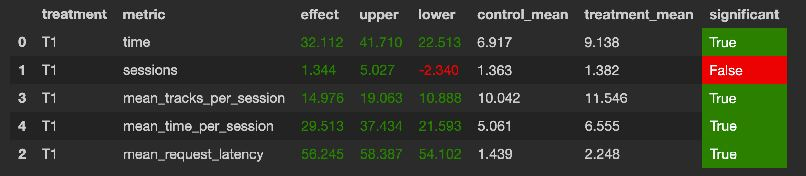

## Abstract

Основная идея заключается в модификации нейросетевого рекомендера, так как мы берем его за бейзлайн.
Модификация заключается в том, чтобы сократить количество рекомендаций рандомным рекомендером.

## Детали

Я сначала попытался просто фолбекаться на Indexed, если не получалось у нейросетевого, но это не дало прироста.  
Затем я заметил, что нейросетевой рекомендер после неудачного трека может опять порекомендовать неудачный, так как за 
основу берет прошлый трек, с которым не вышло. Поэтому, если время прослушивания трека меньше 0.3, вернемся на шаг назад
и порекомендуем другой трек.   
Также я решил, что есть смысл не рекомендовать треки, которые уже были (храню для юзера сет прослушанных), и это тоже дало прирост.  

## Инструкция по запуску

Все по инструкциям в sim и botify.

В юпитере неправильно указан путь до логов, потому не смог закомитить папку через веб версию (логи лежат в корне - data.json).

В файле README.md в sim добавил команду, которая разрешает питону выполняться параллельно 
`export OBJC_DISABLE_INITIALIZE_FORK_SAFETY=YES`
Запускал этой командой
`python sim/run.py --episodes 1000 --config config/env.yml multi --processes 4`
